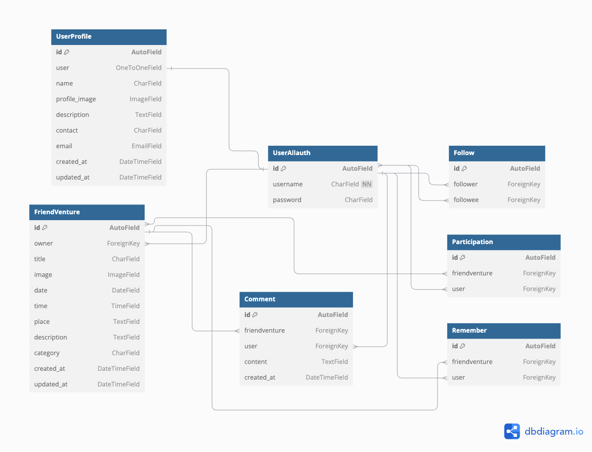
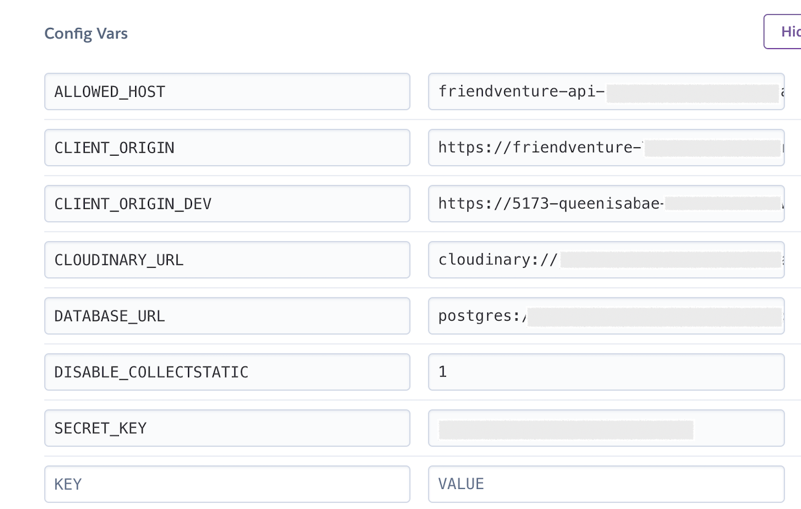

# FriendVenture API

**Advanced Front-End Portfolio Project(PP5) - Code Institute**

The *Friendventure API* is the backend for the FriendVenture application, built using Django Rest Framework. It serves as the foundation for a social network ([FriendVenture](https://friendventure-702f1b6ed9cf.herokuapp.com/)) focused on organizing and participating in (sporting) activities with friends(to be), both indoor and outdoor. 

*FriendVenture API* is designed for users who want to create and join events, called "FriendVenture," which include a title, date, time, description, and location. Other users can confirm their participation or bookmark the FriendVenture for later. Each event is also open for comments, fostering communication and coordination among participants. 

Additionally, users have the ability to follow others, allowing them to stay updated on FriendVentures their friends/followees plan to post in the future.
 
The API is organized into several key apps: 

_friendventures_: Manages the creation and details of events. 
_profiles_: Handles user profiles and related information. 
_participants_: Tracks user participation in various events. 
_comments_: Enables users to comment on Friendventures. 
_bookmarks_: Allows users to save Friendventures they are interested in. 
_followers_: Facilitates the following and tracking of other users' activities. 
 
This API is designed to be consumed by a React frontend, providing a seamless experience for users looking to connect and engage in activities together.
 
 

The deployed API can be found here: [Friendventure API](https://friendventure-api-8b417af3d1a0.herokuapp.com/) 
The deployed React project can be found [here](https://friendventure-702f1b6ed9cf.herokuapp.com/)
The link for the GitHub repository to the associated front end can be found [here](https://github.com/queenisabaer/friendventure)

## Table of Contents

- [User Experience](#user-experience)
- [Structure](#structure)
- [Database](#database)
  - [Models](#models)
- [Features](#features)
- [API Endpoints](#api-endpoints)
- [Bugs](#bugs)
- [Technologies Used](#technologies-used)
  - [Languages](#languages)
  - [Tools](#tools)
  - [Frameworks](#frameworks)
  - [Libraries and modules](#libraries-and-modules)
- [Testing](#testing)
  - [Python Validator Testing](#python-validator-testing)
  - [Manual testing](#manual-testing)
  - [Automated Testing](#automated-testing)
  - [Browser Compatibility](#browser-compatibility)
- [Deployment](#deployment)
  - [Heroku](#heroku)
  - [Local deployment](#local-deployment)
  - [Forking this GitHub repository](#forking-this-github-repository)
  - [Clone this repository](#clone-this-repository)
  - [Cloudinary](#cloudinary)
  - [Create PostgreSQL using Code Institute Database Maker](#create-postgresql-using-code-institute-database-maker)
- [Credits](#credits)
  - [Code](#code)
  - [ReadMe](#readme)
  - [Acknowledgments](#acknowledgments)

## User Experience

I used an Agile methodology approach to plan this project. This was implemented through the GitHub Project board with milestones, epics, user stories and tasks.
Each user story was classified with a label according to MoSCoW prioritization. 
The Kanban board can be seen [here](https://github.com/users/queenisabaer/projects/4). 
More about the user stories can be found in the Readme for the frontend part that can be found [here](https://github.com/queenisabaer/friendventure?tab=readme-ov-file#user-experience)

## Structure

The first database schema was crafted during the planning phase of the project. The second one was created after finishing the project. It only adds two created_at fields and renames some of the tables. Both schemas were created with [dbdiagramm](https://dbdiagram.io/home). 

 
Final ERD: 
 

## Database 
I used a PostgreSQL provided by Code Institute as relational database. 

- **FieldTypes:** 
  - AutoField: An integer field that automatically increments.
  - CharField: A text field with a maximum length.
  - EmailField: A CharField that checks if the value is a valid email address.
  - DateTimeField: A field for storing date and time.
  - DateField: A field for storing dates.
  - TimeField: A field for storing time.
  - TextField: A large text field.
  - ImageField: 
  - OneToOneField: A one-to-one relationship.
  - ForeignKey: A many-to-one relationship.
  - IntegerField: An integer field.
  - EmailField: 
  - DecimalField: A fixed-precision decimal number.
  - URLField: A CharField for URLs. 
- **Relationships:** 
  - A User has one Profile.
  - A Profile belongs to one User.
  - A FriendVenture is created by one User.
  - A User can create many FriendVentures.
  - A User can be a Participant in a FriendVenture.
  - Participant belongs to one User and one Friendventure
  - A User can bookmark a FriendVenture.
  - Bookmark belongs to one User and one Friendventure
  - A User can create a Comment for a FriendVenture. 
  - A Comment belongs to one User and one Friendventure
  - A User can follow another User.

### Models

*Profile*  
- The Profile model represents a user's profile in the application, automatically created when a new user is registered. It includes various fields to store personal information such as the user's name, profile image, description, phone number, and email address. The model also tracks when the profile was created and last updated. The associated *ProfileSerializer* is responsible for serializing the profile data, adding additional computed fields like whether the requesting user owns the profile (is_owner), and validating the profile image size and dimensions. The serializer also integrates follower-related information, such as follower counts and the ID of the current user's following relationship with the profile owner, to support social features in the application. 
 

*Friendventure*  
- The Friendventure model represents an event organized by a user within the application. Each friendventure includes details like the event title, an optional image, the date and time it is scheduled to occur, the location, and a description. The model also categorizes the event as either "Indoor" or "Outdoor," and automatically tracks when the event was created and last updated. The associated *FriendventureSerializer* handles serialization of this data, adding additional fields to represent the ownership status, profile information of the event creator, bookmark and participant details, and counts of bookmarks, comments, and participants. The serializer also ensures that the event's date is in the future and that any uploaded images meet specific size and dimension requirements. 

*Participant*  
- The Participant model represents a user who has joined a specific event, referred to as a "FriendVenture." Each participant is linked to both a user and a FriendVenture event, capturing the relationship between users and the events they choose to participate in. The model includes a timestamp to indicate when the user joined the event and enforces uniqueness, ensuring that a user can only join a particular event once. The associated *ParticipantSerializer* is responsible for serializing participant data, including details about the user and the event, and handles validation to prevent duplicate participation. The serializer raises an error if the user tries to join the same event more than once.  

*Bookmark* 
- The Bookmark model represents a user marking a specific FriendVenture for easy reference or future use. Each bookmark links a user to a FriendVenture, recording when the bookmark was created. The model enforces that a user can only bookmark aa FriendVenture once, ensuring no duplicates. The associated *BookmarkSerializer* is responsible for handling the serialization of bookmark data, including the user and event details. It also includes validation logic to raise an error if a user attempts to bookmark the same event more than once. This structure supports a clean and efficient way to manage user bookmarks within the application. 

*Comment* 
- The Comment model is designed to manage user-generated comments on specific FriendVentures. Each comment is associated with a user (owner) and a FriendVenture, capturing the content of the comment along with timestamps for when it was created and last updated. The model ensures that comments are displayed in reverse chronological order by default, showing the most recent ones first.
The associated *CommentSerializer* handles the serialization of comment data, including details about the user who made the comment, their profile picture, and the timestamps formatted in a human-readable manner. The CommentDetailSerializer extends this by providing additional details, such as the ID of the associated friendventure event. This setup enables efficient management and display of comments within the application, fostering interaction and discussion around friendventure events. 

*Follower* 
- The Follower model manages the relationships where users follow other users within the application. It establishes a connection between the owner (the user who is following) and the followed (the user being followed), allowing for tracking of these interactions. Each follow relationship is time-stamped, showing when it was created, and the model enforces uniqueness to prevent duplicate follow relationships. The data is ordered by the most recent followings by default.
The *FollowerSerializer* is responsible for converting these follow relationships into a serialized format for API responses. It includes fields for the usernames of both the follower and the followed, and it prevents users from following themselves or following the same user multiple times. This ensures the integrity of the following system within the application, supporting functionalities like displaying followers, following counts, and managing user connections.

## Features

### Existing Features

*Home* 
A welcome message is displayed when you first enter the API site.
[Screenshot of welcome message](documentation/readme/welcome-message.png) 

*Profiles* 

A list of all profiles can be seen

### Features, which I would like to implement in the future

- Tagging System with Tagulous: "Integrate a robust tagging system using Tagulous to allow users to categorize their FriendVentures with relevant tags. This feature will enable easier searching and filtering of events based on interests, locations, or activity types, enhancing the overall user experience by making it more intuitive to find and participate in activities that match user preferences."  
- User-to-User Messaging: "Implement a direct messaging feature to facilitate communication between users within the platform. This feature will allow participants to coordinate details, ask questions, and build connections before and after attending Friendventures. The messaging system will support real-time conversations, ensuring seamless interaction among users." 

## Bugs

 404 error on default profile image link in admin console

 
When attempting to click on the link for the default profile image in the admin console, a 404 error was displayed. After trying various approaches and consulting with tutor support, we identified different Django versions as a potential issue. The problem was resolved by downgrading from Django 5 to Django 4.

It is important to note that the issue was not directly caused by Django itself but by the Django Cloudinary Storage plugin, which has not been updated since 2020 and is therefore not compatible with Django 5.
 
 

 

 Error during test for logged-in user creating a new friendventure 

 
When setting up the test to ensure that only a logged-in user can create a new friendventure, the following error was displayed in the terminal: 

_[ErrorDetail(string='The submitted data was not a file. Check the encoding type on the form.', code='invalid')]_ 

The error message indicates that the image field is expected to be a file upload, but the submitted data is not a valid file. I suspected that this was because the ImageField was not set to blank=True and my testimage had the wrong path. After adding the attribute to the model and migrating it to the database, the test executed without any issues.
 
 

 

 Error during final test for Readme screenshot 

 
When attempting to update a Friendventure in the test_user_can_update_friendventure test for the final readme test, the title did not change as expected, leading to a failed assertion. Furthermore, the test to check if a logged in user can create a FreindVenture failed too. After trying various approaches and reviewing the test setup, I identified that the issue was due to the date field being set to a past date. The problem was resolved by ensuring that the date field is set to a future date during the update operation. 
 

Screnshot of error messages in the terminal: 
 
Screenshot of final test: 
 

 Axios error during log in 

 
When tryning to log in to an account in my frontend project, the following error was displayed in the console: 

 

I assumed it was because of the newest version of dj-rest-auth, that I am using and the settings I did with the walkthrough project(using an older version). In previous versions, settings such as JWT_AUTH_COOKIE, JWT_AUTH_REFRESH_COOKIE, etc., were accessed directly from the settings module. However, the new structure requires accessing these settings through the REST_AUTH dictionary. After updating my settings file and trying to deploy it to heroku, the building process failed.  

 

The error occurred because JWT-related settings were being imported into the views.py directly from settings.py, while in the new version of dj-rest-auth, these settings are now nested within the REST_AUTH dictionary. To resolve this issue, I updated the views.py file to access the JWT settings from the REST_AUTH dictionary rather than importing them directly.
 
 

 CORS policy error 

 
When working on the EditFriendventureForm, from one second to the next, I wasn't no longer able to interact with the site. In the console it showed the following error: 

 

At first I thought the server was down, as it seemed to be really sudden and not related to my work on the code. After a certain time had passed, and I still could not access the site, I contacted Tutor support. I had to edit the settings in relation to the CLIENT_ORIGIN_DEV, after which I could access everything again. 
 
 

## Technologies Used

### Languages:
- [Python](https://en.wikipedia.org/wiki/Python_(programming_language))

### Tools:
- [Git](https://git-scm.com/) was used for version control by utilizing the Gitpod terminal to commit to Git and Push to GitHub.
- [GitHub](https://github.com/) was used to save and store the files for the website.
- [GitHub Issues](https://docs.github.com/en/issues) have been used for Agile methodology by assigning user stories to issues and using labels to organize user stories.
- [GitHub Projects](https://docs.github.com/en/issues/planning-and-tracking-with-projects/learning-about-projects/about-projects) have been used for Agile sprint planning and task tracking.
- [Heroku](https://www.heroku.com) was used to deploy the application.
- [CI Gitpod](https://codeinstitute-ide.net/) was used as IDE. 
- [Code Insitute Database Maker](https://dbs.ci-dbs.net/) PostgreSQL database hosting for this project
- [Black Formatter](https://marketplace.visualstudio.com/items?itemName=ms-python.black-formatter) to beautify the code
- [LanguageTool](https://languagetool.org/) was used to check the grammar and spelling in the README and the Code. 
- [Pixelied](https://pixelied.com/convert/jpg-converter/jpg-to-webp) was used to convert jpg images into wepb images.
- [Tinypng](https://tinypng.com/) was used to compress the webp background-image.
- [Pixabay](https://www.pixabay.com/de-de/) was used to search and load the ghost for the logo.
- [Browserling](https://www.browserling.com/) was used to test the application on different browsers.
- [Cloudinary](https://cloudinary.com/) was used to store the item images.
- [Canva](https://www.canva.com/) was used to create the logo and the default image for a friendventure.
- [Favicon.io](https://favicon.io/favicon-generator/) was used to create the favicon.
- [Google Chrome Dev Tools](https://developer.chrome.com/docs/devtools?hl=de) were used to check the application for responsiveness and errors. 

### Frameworks:  
- [Django Rest Framework](https://www.django-rest-framework.org/)
- [Django](https://en.wikipedia.org/wiki/Django_(web_framework))

### Libraries and modules:
- [os](https://docs.python.org/3/library/os.html) provides functions to interact with the operating system. 
- [sys](https://docs.python.org/3/library/sys.html) was used to get system-specific functions.
- [datetime](https://docs.python.org/3/library/time.html) supplies classes for manipulating dates and times.
- [Gunicorn](https://gunicorn.org/) provides a way to serve Python web applications.
- [Pycopg 2](https://pypi.org/project/psycopg2/) is a PostgreSQL database adapter for Python.
- [sqlparse](https://pypi.org/project/sqlparse/): A non-validating SQL parser for Python.
- [dj_database_url](https://pypi.org/project/dj-database-url/) enables the ability to represent their database settings via a string.
- [django-cloudinary-storage](https://pypi.org/project/django-cloudinary-storage/): was used to connect Cloudinary as Django file storage
- [django-cors-headers](https://pypi.org/project/django-cors-headers/): Handle Cross-Origin Resource Sharing in Django
- [django-filter](https://pypi.org/project/django-filter/): Provides filtering with URL parameters for querysets
- [dj-rest-auth](https://dj-rest-auth.readthedocs.io/en/latest/): to handle user registration, login, and logout
- [djangorestframework-simplejwt](https://django-rest-framework-simplejwt.readthedocs.io/en/latest/getting_started.html): JSON Web Token authentication for Django REST Framework.
- [oauthlib](https://oauthlib.readthedocs.io/en/latest/): A generic, spec-compliant, thorough implementation of the OAuth request-signing logic.
- [PyJWT](https://pyjwt.readthedocs.io/en/stable/): JSON Web Token implementation in Python.
- [python3-openid](https://pypi.org/project/python3-openid/): A library for implementing OpenID in Python.
- [requests-oauthlib](https://pypi.org/project/requests-oauthlib/): OAuth library that implements the client side of the OAuth protocol.
- [dj-database-url](https://pypi.org/project/dj-database-url/): A simple utility to allow using Database URLs in Django.
- [whitenoise](https://whitenoise.readthedocs.io/en/latest/): A Django middleware to serve static files 
- [asgiref](https://github.com/django/asgiref): ASGI (Asynchronous Server Gateway Interface) reference library, used by Django for handling asynchronous web protocols
- [pillow](https://pypi.org/project/pillow/): A Python Imaging Library (PIL) fork, adding image processing capabilities to your Python applications.

## Testing

The app was tested regularly and deployed to Heroku to make sure both local and remote worked the same.

### Python Validator Testing

- All created python files were checked with the [Code Insitute validator - CI Python Linter](https://pep8ci.herokuapp.com/#).  

### Manual Testing

- *URL Path Verification*: Confirmed that all URL endpoints were correctly set up and functioning as expected, with no errors encountered during navigation. 
- *CRUD Operations Validation*: Conducted thorough testing of the create, read, update, and/or delete operations across various entities, including: friendventures, comments, bookmarks, profiles, followers, and participants.
  - Successfully created new entries and ensured the corresponding URLs were working properly.
  - Verified the update functionality, ensuring data could be correctly modified (with the exception of followers and likes).
  - Performed delete operations to confirm that FriendVentures and comments could be removed as intended.
- *FriendVenture Search Functionality Testing*: Evaluated the search feature specifically for FriendVentures to ensure it was operating correctly and returned accurate results.

These manual tests were conducted to ensure that the API operates smoothly and behaves as intended.

### Automated Testing
To cover all the user story scenarios, the following automated tests have been written into the Friendventure API.  

**Friendventures** 
Tests to ensure that the API endpoints for listing and managing friendventures behave as expected.
- *FriendventureListViewTest*: Tests for the FriendventureList view, which handles listing and creating friendventures.
  - The *test_can_list_friendventures* test verifies that the /friendventures/ endpoint successfully returns a list of friendventures, confirming that the API responds with an HTTP 200 OK status.
  - The *test_logged_in_user_can_create_friendventure* test checks that a logged-in user can create a new friendventure. This test ensures that the API correctly adds a new friendventure and responds with an HTTP 201 CREATED status.
  - The *test_logged_out_user_cant_create_friendventure *test ensures that an unauthenticated user cannot create a new friendventure, confirming that the API returns an HTTP 403 FORBIDDEN status.
- *FriendventureDetailViewTest*: Tests for the FriendventureDetail view, which handles individual friendventure details.
  - The *test_can_retrieve_friendventure_with_id* test checks that a friendventure can be retrieved successfully when a valid friendventure ID is provided. This test ensures that the API responds with an HTTP 200 OK status and returns the correct details.
  - The *test_cant_retrieve_friendventure_using_invalid_id* test ensures that attempting to retrieve a friendventure with an invalid ID results in an HTTP 404 NOT FOUND response, confirming that the API handles invalid requests properly.
  - The *test_user_can_update_friendventure* test verifies that a logged-in user can update their own friendventure. This test ensures that changes are applied correctly and that the API responds with an HTTP 200 OK status.
  - The *test_user_cant_update_other_users_friendventure* test checks that a user cannot update another user’s friendventure, confirming that the API returns an HTTP 403 FORBIDDEN status when an unauthorized update attempt is made.
  - The *test_user_can_delete_own_friendventure* test ensures that a logged-in user can delete their own friendventure. This test verifies that the API processes the deletion correctly and responds with an HTTP 204 NO CONTENT status.
  - The *test_user_cant_delete_other_users_friendventure* test checks that a user cannot delete another user’s friendventure, confirming that the API returns an HTTP 403 FORBIDDEN status when an unauthorized deletion attempt is made.
  - The *test_default_category_is_outdoor* test verifies that when a friendventure is created without specifying a category, the default category is set to "Outdoor". This test confirms that the API responds with an HTTP 200 OK status and correctly assigns the default category. 

**Profiles** 
Tests to ensure that the API endpoints for listing and managing user profiles behave as expected. 
- *ProfileListViewTest*: Tests for the ProfileList view, which handles listing profiles. The *test_profile_is_created_automatically* test verifies that a profile is automatically created for each user, and checks that the number of profiles matches the number of users in the database.The *test_list_profiles* test ensures that the /profiles/ endpoint successfully returns a list of profiles, and confirms that the API responds with an HTTP 200 OK status.
- *ProfileDetailViewTests*: Tests for the ProfileDetail view, which handles individual profile details.
  - The *test_can_retrieve_profile_using_valid_id* test checks that a profile can be retrieved successfully when a valid profile ID is provided. This test verifies that the response status is HTTP 200 OK for a valid profile request.
  - The *test_cant_retrieve_profile_using_invalid_id* test ensures that requesting a profile with an invalid ID results in an HTTP 404 NOT FOUND response, and confirms that the API correctly handles invalid profile requests. 
  - The *test_logged_in_user_can_update_own_profile* test checks that a logged-in user is able to update their own profile information, and that changes are applied correctly and the response status is HTTP 200 OK. 
  - The *test_user_cant_update_other_users_profile* test verifies that a user cannot modify another user’s profile, and ensures that the API returns an HTTP 403 FORBIDDEN status when an unauthorized update attempt is made.
 

**Followers** 
Tests to ensure that the API endpoints for listing and managing followers behave as expected. 
- *FollowerListViewTest*: Tests for the FollowerList view, which handles listing and creating follower relationships. 
  - The *test_can_list_followers* test verifies that the /followers/ endpoint successfully returns a list of followers, confirming that the API responds with an HTTP 200 OK status.
  - The *test_logged_in_user_can_follow_other_user* test checks that a logged-in user can successfully follow another user. This test ensures that the follower relationship is created correctly and that the API responds with an HTTP 201 CREATED status.
  - The *test_logged_out_user_cant_follow_other_user* test ensures that an unauthenticated user cannot follow another user, confirming that the API returns an HTTP 403 FORBIDDEN status.
  - The *test_cant_follow_other_user_twice* test verifies that a user cannot follow the same user twice, ensuring that the API correctly prevents duplicate follower relationships and responds with an HTTP 400 BAD REQUEST status.
- *FollowerDetailViewTest*:  Tests for the FollowerDetail view, which handles individual follower relationship details. 
  - The *test_can_retrieve_follower_with_id* test checks that a follower relationship can be retrieved successfully when a valid follower ID is provided. This test ensures that the API responds with an HTTP 200 OK status.
  - The *test_cant_retrieve_follower_using_invalid_id* test ensures that attempting to retrieve a follower relationship with an invalid ID results in an HTTP 404 NOT FOUND response, confirming that the API handles invalid requests properly.
  - The *test_user_can_unfollow_other_user* test verifies that a logged-in user can successfully unfollow another user. This test ensures that the follower relationship is deleted correctly and that the API responds with an HTTP 204 NO CONTENT status.
  - The *test_user_cant_delete_folloing_of_other_users* test checks that a user cannot delete a follower relationship between two other users, confirming that the API returns an HTTP 403 FORBIDDEN status when an unauthorized deletion attempt is made.
  - The *test_user_cant_unfollow_other_user_if_not_logged_in* test ensures that an unauthenticated user cannot unfollow another user, verifying that the API returns an HTTP 403 FORBIDDEN status. 

**Participants** 
Tests to ensure that the API endpoints for listing and managing participants in friendventures behave as expected. 
- *ParticipantListViewTest*: Tests for the ParticipantList view, which handles listing and managing participants. 
 - The *test_auto_create_participant_with_owner_friendventure* test verifies that a participant is automatically created for the owner when a new friendventure is created, ensuring that the initial participant count is correct.
 - The *test_can_list_participants* test ensures that the /participants/ endpoint successfully returns a list of participants, confirming that the API responds with an HTTP 200 OK status.
 - The *test_logged_in_user_can_participate_in_friendventure* test checks that a logged-in user can join a friendventure, ensuring that the API correctly adds a new participant and responds with an HTTP 201 CREATED status.
 - The *test_logged_out_user_cant_participate* test ensures that an unauthenticated user cannot participate in a friendventure, confirming that the API returns an HTTP 403 FORBIDDEN status.
 - The *test_cant_participate_in_a_friendventure_twice* test verifies that a user cannot join the same friendventure more than once, ensuring that the API prevents duplicate participation and returns an HTTP 400 BAD REQUEST status.  

 **Comments** 
 Tests to ensure that the API endpoints for listing and managing comments function correctly. 
 - *CommentListViewTest*: Tests for the CommentList view, which handles listing and creating comments. 
  - The *test_can_list_comments* test verifies that the /comments/ endpoint successfully returns a list of comments, ensuring that the API responds with an HTTP 200 OK status.
  - The *test_logged_in_user_can_create_comment* test checks that a logged-in user can successfully create a comment on a friendventure. This test confirms that the comment is created correctly and that the API responds with an HTTP 201 CREATED status.
  - The *test_logged_out_user_cant_create_comment* test ensures that an unauthenticated user cannot create a comment, verifying that the API returns an HTTP 403 FORBIDDEN status.
- *CommentDetailViewTest*: Tests for the CommentDetail view, which handles retrieving, updating, and deleting individual comments. 
  - The *test_can_retrieve_comment_with_id* test checks that a specific comment can be retrieved successfully when a valid comment ID is provided. This test ensures that the API responds with an HTTP 200 OK status and returns the correct comment data.
  - The *test_cant_retrieve_comment_using_invalid_id* test verifies that attempting to retrieve a comment with an invalid ID results in an HTTP 404 NOT FOUND response, confirming that the API handles invalid requests appropriately.
  - The *test_user_can_update_comment* test ensures that a logged-in user can successfully update their own comment. This test checks that the comment content is updated correctly and that the API responds with an HTTP 200 OK status.
  - The *test_user_cant_update_other_users_comment* test verifies that a user cannot update another user's comment, confirming that the API returns an HTTP 403 FORBIDDEN status when an unauthorized update attempt is made.
  - The *test_user_can_delete_own_comment* test checks that a logged-in user can successfully delete their own comment. This test ensures that the comment is deleted correctly and that the API responds with an HTTP 204 NO CONTENT status.
  - The *test_user_cant_delete_other_users_comment* test ensures that a user cannot delete another user's comment, verifying that the API returns an HTTP 403 FORBIDDEN status when an unauthorized deletion attempt is made. 

**Bookmarks** 
Tests to ensure that the API endpoints for listing and managing bookmarks function correctly. 

- *BookmarkListViewTest*: Tests for the BookmarkList view, which handles listing and creating bookmarks.  
  - The *test_can_list_bookmarks* test verifies that the /bookmarks/ endpoint successfully returns a list of bookmarks, ensuring that the API responds with an HTTP 200 OK status.
  - The *test_logged_in_user_can_bookmark_a_friendventure* test checks that a logged-in user can successfully bookmark a friendventure. This test confirms that the bookmark is created correctly and that the API responds with an HTTP 201 CREATED status.
  - The *test_logged_out_user_cant_bookmark* test ensures that an unauthenticated user cannot bookmark a friendventure, verifying that the API returns an HTTP 403 FORBIDDEN status.
  - The *test_cant_bookmark_a_friendventure_twice* test verifies that a user cannot bookmark the same friendventure more than once, ensuring that the API responds with an HTTP 400 BAD REQUEST status when an attempt is made to do so.
- *BookmarkDetailViewTest*: Tests for the BookmarkDetail view, which handles retrieving and deleting individual bookmarks. 
  - The *test_can_retrieve_bookmark_with_id* test checks that a specific bookmark can be retrieved successfully when a valid bookmark ID is provided. This test ensures that the API responds with an HTTP 200 OK status and returns the correct bookmark data.
  - The *test_cant_retrieve_bookmark_using_invalid_id* test verifies that attempting to retrieve a bookmark with an invalid ID results in an HTTP 404 NOT FOUND response, confirming that the API handles invalid requests appropriately.
  - The *test_user_can_delete_own_bookmark* test ensures that a logged-in user can successfully delete their own bookmark. This test checks that the bookmark is deleted correctly and that the API responds with an HTTP 204 NO CONTENT status.
  - The *test_user_cant_delete_other_users_bookmark* test verifies that a user cannot delete another user's bookmark, confirming that the API returns an HTTP 403 FORBIDDEN status when an unauthorized deletion attempt is made. 

Screenshot of final test: 
 

### Browser Compatibility
  The tests were conducted using the following browser:

- Google Chrome Version 127.0.6533.120 
- Safari 17.4.1  

## Deployment

### Heroku
This site is deployed using Heroku. To deploy it from its GitHub repository to Heroku, I took the following steps:

1. Create a list of requirements in the requirements.txt file by using the command _pip3 freeze > requirements.txt_
2. Log in (or sign up) to Heroku
3. Click on the _New_ button and select _Create new app_
4. Give it a unique name and choose the region _Europe_
5. Click the *Settings* tab, go to the _Config Vars_ section and click on the _Reveal Config Vars_ button
6. Add all variables from *env.py* to _ConfigVars_ of Heroku
 
7. Click the _Add_ button
8. Click the *Deploy* tab, go to the _Deployment method_ section, select _GitHub_ and confirm this selection by clicking on the _Connect to Github_ button
9. Search for the repository name on github _friendventure_ and click the _Connect_ button
10. Add in the setting.py the Heroku app URL into ALLOWED HOSTS 
11. Gather all static files of the project by using the command _python3 manage.py collectstatic_ in the terminal
12. Make sure that DEBUG=FALSE in settings.py
13. Create a _Procfile_ in the root directory and add *web: gunicorn fv_api.wsgi*
13. In Heroku enable the automatic deploy or manually deploy the code from the main branch

To see the [view of the live site](https://friendventure-api-8b417af3d1a0.herokuapp.com/) click on the _Open app_ button in the top right corner or, if you enabled automatic deploy (step 13), log in to GitHub, navigate to the repository for this project by selecting [*queenisabaer/friendventure-api*](https://github.com/queenisabaer/friendventure-api), click on the _Deployments_ heading and choose in the _Environments_ section friendventure_api. On top of the latest deployment is the link to the [live site](https://friendventure-api-8b417af3d1a0.herokuapp.com/). 

### Local deployment

1. Generate an env.py file in the root directory of the project
2. Configure the environment variables within this file.
3. Create a virtual environment, if neccessary
4. Install all required dependencies using _pip install_ command (into the .venv)
5. Add dependencies to the requirements.txt file using _pip3 freeze > requirements.txt_ command

### Forking this GitHub repository
1.  Log in to GitHub.
2.  Navigate to the repository for this project by selecting [*queenisabaer/friendventure-api*](https://github.com/queenisabaer/friendventure-api)
3. Click at the top of the repository on the **Fork** button on the right side

### Clone this repository
1. Log in to GitHub.
2. Navigate to the repository for this project by selecting [*queenisabaer/friendventure-api*](https://github.com/queenisabaer/friendventure-api)
3. In the top-right corner, click on the green *Code* button
4. Copy the HTTPS URL in the tab *Local*
5. Go to the code editor of your choice and open the terminal
5. Type `git clone` and paste the URL you copied into your terminal
6. Press the enter key

### Cloudinary
1. Navigate to [Cloudinary](https://cloudinary.com/)
2. Sign up or log in to account
3. Go to the dashboard
4. Click on _Go to API Keys_ button
5. Generate a new API Key
6. Provide the API environment variable in format: *CLOUDINARY_URL=cloudinary://<your_api_key>:<your_api_secret>@ds5rjhhxu* in _env.py_ and _Config Vars_
7. Update settings.py

### Create PostgreSQL using Code Institute Database Maker
1. As Student of the Code Institute, navigate to the [CI Database Maker](https://dbs.ci-dbs.net/)
2. Input your email address
3. Paste the provided URL in as your DATABASE_URL value

## Credits

### Code
- The initial setup and overall architecture of this project were guided by the Code Institute's Django Rest Framework walkthrough project. The core elements of the Profile, Friendventure, Follower, Bookmark, Participant, and Comment models, along with their respective serializers, filtering capabilities, and tests, were derived from the walkthrough project and subsequently tailored to meet the unique requirements of this project.
- A great help and inspiration were the advanced frontend projects by [Kelly Hutchinson](https://github.com/quiltingcode/events-backend-api), [Ronja Sjögren](https://github.com/Ajn0r/pet-palace-api), [Johannes Bernet](https://github.com/nacht-falter/sonic-explorers-api), and [Shubham Sinha](https://github.com/Sinha5714/pp5-api-ref/tree/main/pp5_api)
- How to Create and Use Signals in Django (To automatically include user who owns a friendventure as participant.) was found in an article by kt775629 at [GeeksForGeeks](https://www.geeksforgeeks.org/how-to-create-and-use-signals-in-django/)

- The following websites were used as a source of knowledge:  
  - [Google](www.google.com)
  - [mdn](https://developer.mozilla.org/en-US/)
  - [W3C](https://www.w3.org/)
  - [W3schools](https://www.w3schools.com/)
  - [DevDocs](https://devdocs.io/)
  - [Stack Overflow](https://stackoverflow.com/)
  - [reddit](https://www.reddit.com/)
  - [forum djangoproject](https://forum.djangoproject.com/)
  - Documentation for [Django](https://www.djangoproject.com/), [Django Rest Framework]((https://www.django-rest-framework.org/)), [Cloudinary](https://cloudinary.com/documentation)
  - Slack Community
  - For troubleshooting, [Google](www.google.com), [Phind](https://www.phind.com/search?home=true), and [ChatGPT](https://chatgpt.com/) were used, too. Especially since the walkthrough project is completely outdated and many of the components no longer work as they should. However, I wanted to work with the latest versions as much as possible to demonstrate that I can adapt accordingly through proper research.

### ReadMe

- One last time, a big thank you to [Kera Cudmore](https://github.com/kera-cudmore) and all of her tips on what makes a good README.

### Acknowledgements

- I would like to thank my wonderful mentor Gareth McGirr for his numerous tips and great assistance during the creation of this project.  
- A big thank you to [Dennis Schenkel](https://github.com/DennisSchenkel) for all his help on this project, especially for assisting with setting up the project and getting the latest versions of React, React Router DOM, and React Bootstrap working with Vite. Thank you so much for all the brainstorming sessions to refine the code or your emotional support. 
- Furthermore, I would like to give a shoutout to the wonderful tutor team who helped me numerous times when I was stuck and struggling to achieve the results I was aiming for. Your support and guidance have been amazing. Thank you!

**This is for educational use.**